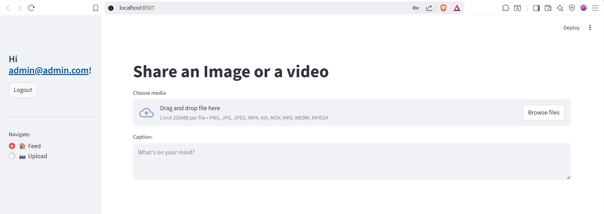
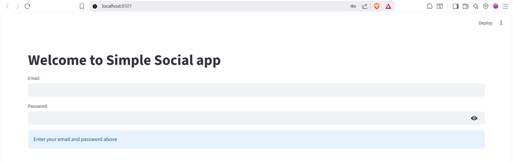
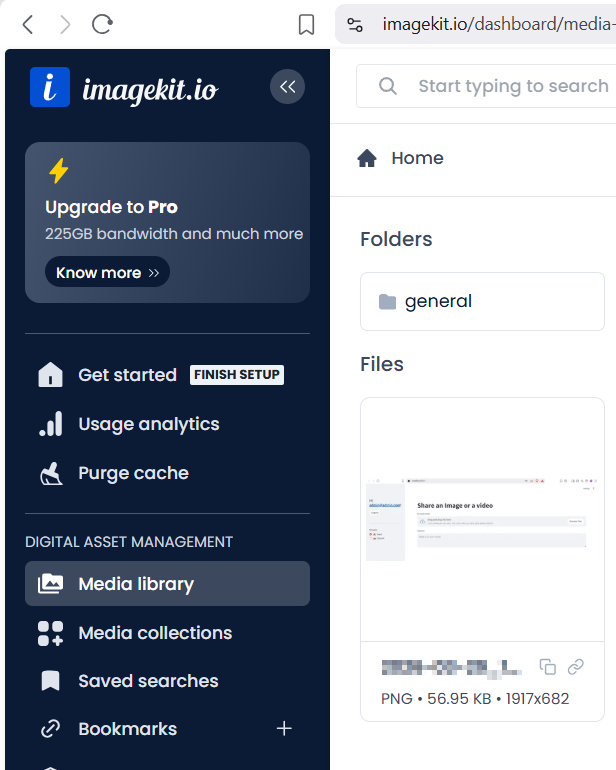

# Simple Social 📸

A social media-style web app that allows users to register, log in, and upload images and videos. Media is hosted on **[ImageKit.io](https://imagekit.io)** and displayed in a shared feed with caption overlays.

Built with **FastAPI** (backend) and **Streamlit** (frontend).

---

## Screenshots

### Home / Feed Page



### Login Page



### Uploaded Image



---

## Features

- User registration and JWT-based authentication
- Upload images (`png`, `jpg`, `jpeg`) and videos (`mp4`, `avi`, `mov`, `mkv`, `webm`)
- Media is stored and served via ImageKit.io with transformation support
- Caption overlays rendered directly on images using ImageKit's text overlay API
- Shared feed showing all posts from all users, ordered by newest first
- Post deletion (owners only)

---

## Tech Stack

| Layer     | Technology                         |
| --------- | ---------------------------------- |
| Backend   | FastAPI, FastAPI-Users, SQLAlchemy |
| Frontend  | Streamlit                          |
| Database  | SQLite (async via aiosqlite)       |
| Media CDN | ImageKit.io                        |
| Auth      | JWT (Bearer tokens)                |

---

## Prerequisites

- Python 3.13+
- A free [ImageKit.io](https://imagekit.io) account
- `uv` (recommended) or `pip`

---

## Setup

### 1. Clone the repository

```bash
git clone https://github.com/WeshTech/fast_api_app.git
cd fast_api
```

### 2. Install dependencies

**Using uv (recommended):**

```bash
uv sync
```

### 3. Configure environment variables

Copy the example env file and fill in your ImageKit credentials:

```bash
cp .env.example .env
```

Open `.env` and set the following:

```env
IMAGEKIT_PUBLIC_KEY=your_public_key_here
IMAGEKIT_PRIVATE_KEY=your_private_key_here
IMAGEKIT_URL=https://ik.imagekit.io/your_imagekit_id
```

> You can find these values in your [ImageKit dashboard](https://imagekit.io/dashboard/developer/api-keys).

---

## Running the App

The app has two parts that must run **simultaneously** in separate terminals.

### Terminal 1 — Start the Backend (FastAPI)

```bash
streamlit run main.py
```

> The backend will start at `http://localhost:8000`  
> API docs available at `http://localhost:8000/docs`

### Terminal 2 — Start the Frontend (Streamlit)

```bash
streamlit run frontend.py
```

> The frontend will open automatically in your browser at `http://localhost:8501`

---

## API Endpoints

| Method   | Endpoint           | Description                   | Auth Required |
| -------- | ------------------ | ----------------------------- | ------------- |
| `POST`   | `/auth/register`   | Register a new user           | No            |
| `POST`   | `/auth/jwt/login`  | Log in and receive JWT token  | No            |
| `GET`    | `/users/me`        | Get current user info         | Yes           |
| `POST`   | `/upload`          | Upload an image or video post | Yes           |
| `GET`    | `/feed`            | Get all posts (newest first)  | Yes           |
| `DELETE` | `/posts/{post_id}` | Delete a post (owner only)    | Yes           |

---

## Project Structure

```
fast_api/
├── app/
│   ├── app.py          # FastAPI routes and app setup
│   ├── db.py           # Database models and session setup
│   ├── images.py       # ImageKit client configuration
│   ├── schemas.py      # Pydantic schemas
│   └── users.py        # Auth and user manager
├── images/
│   ├── home_page.png
│   ├── login_page.png
│   └── uploaded_image.png
├── frontend.py         # Streamlit UI
├── main.py             # Uvicorn entrypoint
├── pyproject.toml      # Project dependencies
├── .env                # Your secrets (never commit this)
├── .env.example        # Template for environment variables
└── .gitignore
```

---

## Notes

- The `.env` file is gitignored — never commit your ImageKit keys
- The SQLite database (`test.db`) is local and auto-created on first run
- Caption text is encoded and overlaid on images using ImageKit's transformation API

## Initial Author

**Tim Ruscica**

All credit goes to [Tim Ruscica](https://github.com/techwithtim) for building the first version.
